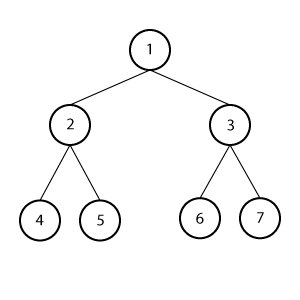
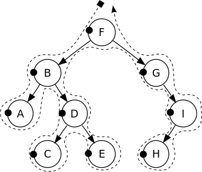
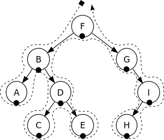
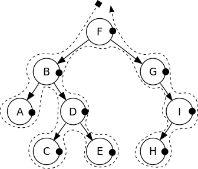
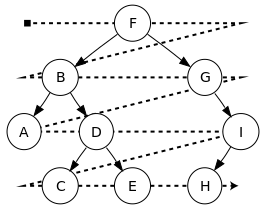

# Binary Tree


Binary tree is called so because of its shape. It's like a tree, it have leaves and a root. In computer science, the "tree" is usually upside down, the root at the top and leaves grow below it. It is binary so it every node only can have 0, 1 or 2 leaves.

<br>

## Terminologies

### Leaf Node
The node do NOT have any child nodes.

### Inner Node
The Node between the leaf node and the root.

### Height and Depth
Height and Depth of the **tree** are basically the same thing which indicates how many levels the tree have, usually starts at 0.

However, the height and depth of the **node** is different. The **height** and **depth** of a node is the distance on longest path to the leaf node and root respectively.


## Types

### Full Binary Tree
Every node in the tree has either 0 or 2 children.




### Complete Binary Tree
Every level except possibly the last level, has maximum number of nodes. All nodes in the last level are all at the left of the tree continuously.

Total number of nodes \\(k\\) | Height of tree \\(h\\)
--- | ---
\\(2^h \le k \lt 2^{h+1} - 1\\) | \\(h = \lfloor\log_2k\rfloor\\)


## Implementation

### Array
Array can be used to store a tree, usually in breadth-first order. It is quite good at store a complete binary tree as it will not waste spaces. The root is store at the index \\(i = 0\\), and its children are stored in \\(i = 1\\) and \\(i = 2\\). It has property that **A node at \\(i\\), its children at \\(2i + 1\\) (left) and \\(2i + 2\\) (right)**. However, it wastes a lot of spaces when storing other trees other than complete binary trees.

### Struct or Class
Creating nodes and connect them to their parents.

``` cpp
struct node {
    int data;
    struct node* left;
    struct node* right;
}
```


## Tree Traversal

### Depth First Search (DFS)
Search the tree in the priority of depth. Using recursive calls for tree traversal is usually a good idea.

#### Pre-order
Root-Left-Right

1. Starts from the root
1. If left subtree has element in it, go to left. If not, go right.

#### In-order
Left-Root-Right

#### Post-order
Left-Right-Root

#### Determine a unique tree
There are only two ways to determine a unique tree given two types of traverse order.

##### Pre-order and In-order
The first element of a pre-order must be the root of the tree. Then find the same element in the In-order, we can divide the tree into two subtrees, left and right. Using the length of the left and right subtrees to find the sequences in pre-order respectively, then we can find the root element for left and right subtrees. Recursive repeat this process.

##### In-order and Post-order
Similar as above, except the root element is the last element in post-order traversal.

#### Tips
Rather than remembering the sequence, there is another way to remembering the  order.

1. Draw a continuous line, starts and ends at the root of the tree, starts from left, around the tree
1. Try following:
  - Pre-order: draw a dot at the **left** of each node
  - In-order: draw a dot at the **bottom** of each node
  - Post-order: draw a dot at the **right** of each node
1. Follow the line we drew, the sequence of touching dots is the sequence of traversal.

Pre-order|In-order|Post-order
---|---|---
||

### Breadth First Search (BFS)
Traverse from the root to bottom, go thought each level first.



