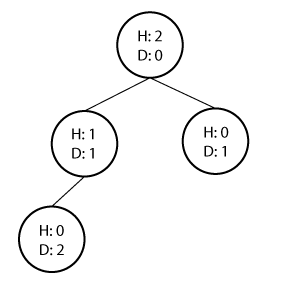
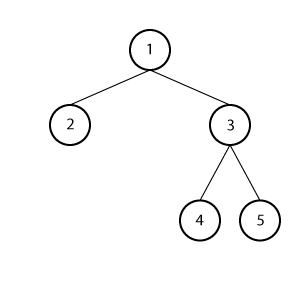
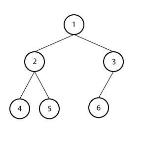
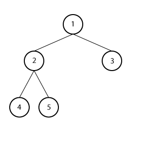

二叉树之所以叫二叉树，是因为它每一个节点都至多有两个叉，又形似一棵树。树有根，有枝，有叶，只不过一般我们在计算机中所说的树都是根在上，叶在下的。

<br>

## 关于树的名词

### 叶节点
没有任何子节点的节点。

### 内节点
在根节点和叶节点中间的节点。

### 高度和深度
**树**的高度和深度指的都是该树有多少层，一般从0开始数。

但是，**节点**的高度和深度所指的就不同了。节点的高度是指该节点到**叶节点**的最长距离，节点的深度是指该节点到**根节点**的最长距离。




## 二叉树类型

### 满二叉树
每个节点都有0或2个字子节点的树。




### 完全二叉树
一棵深度为\\(h\\)的树，除了第\\(h\\)层外，其他各层节点都为最大树，第\\(h\\)层的所有节点都连续地集中在左边。

总节点\\(k\\) | 树高\\(h\\)
--- | ---
\\(2^h \le k \lt 2^{h+1} - 1\\) | \\(h = \lfloor\log_2k\rfloor\\)





## 实现

### 数组
树可以用数组来存储，一般是广度优先的顺序。数组可以很好地储存完全二叉树，因为完全二叉树不会浪费数组的空间。一般来说，根节点一般储存在\\(i = 0\\), 它的子节点存在\\(i = 1\\)和\\(i = 2\\)，分别代表左节点和右节点。**一个节点在\\(i\\), 它的左右节点分别在\\(2i + 1\\)和\\(2i+2\\)**。但是，数组会浪费很多空间如果树不完全。

### Struct 或者 Class
创建节点，与父节点关联。

``` cpp
struct node {
    int data;
    struct node* left;
    struct node* right;
}
```


## 树的遍历

### 深度优先遍历(DFS)
遍历树按照深度优先的原则，使用递归一般在遍历中是个好主意。

#### 先序遍历
根节点－左节点－右节点

1. 从根节点开始
1. 如果左子树有元素，遍历左子树，不然遍历右子树。

#### 中序遍历
左－根－右

#### 后序遍历
左－右－根

#### 确定唯一的树
给定两种遍历顺序，只有两种方法能确定唯一的树。

##### 先序遍历和中序遍历
先序遍历的第一个元素必定是树的根节点，在中序遍历中找到该节点，就能把树分为两个子树，左子树和右子树。根据左右子树的长度在先序遍历中找到对应的序列，便找到了左右子树的根节点。不断递归直到遍历树。

##### 中序遍历和后序遍历
和上面说的类似，只是后序遍历的根节点在序列的最后。

#### 小技巧
还有另外一种办法来记住遍历的顺序

1. 画一条连续的线（一笔画），从根节点开始，往左画，包围整棵树，贴着节点，在根节点结束。
1. 类别：
    - 先序：在每个节点的**左边**画一个点
    - 中序：在每个节点的**下面**画一个点
    - 后序：在每个节点的**右边**画一个点
1. 从根节点开始，沿着画线的顺序，碰到点的顺序就是遍历的顺序。

先序遍历|中序遍历|后序遍历
---|---|---
||

### 广度优先遍历(BFS)
从根节点开始，以遍历完每一层为优先原则。


