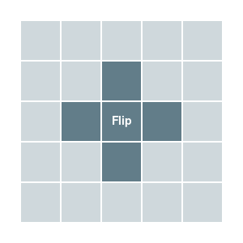
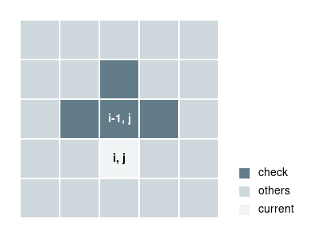

# POJ 3279 Fliptile


There are \\(M \times N\\) \\((1 \le M, N \le 15)\\)square tiles. Each tile can be flipped and the color of tile can change between black(1) and white(0).

When you flip a tile, 4 adjacent tiles will also be flipped. Note that the four adjacent flipped tiles will NOT cause their adjacent tiles to flip.

Given a configuration, find the minimum number of flips so that all square tiles become white. If having the minimum number is the same, choose the least lexicographical one<sup>1</sup>.

If there is no solution, print "IMPOSSIBLE".

Link: http://poj.org/problem?id=3279



<sub>*1 lexicographical order: When you read from left to right, compare each of character of them, see which one is less in alphabetically order. For example, \\(AA \lt AB \lt BA \lt BB\\). In this case, we read from left to right, up to down* </sub>

```
0 0 0       0 0 0       1 0 0
0 0 0   <   1 1 1   <   0 0 0
0 0 0       1 1 1       0 0 0
```

<br />
<br />
<br />
<br />
<br />

:warning:THINK HARDER

<br />
<br />
<br />
<br />
<br />

### Solution

If we try to brute force, with time complexity of \\(O(2^{MN})\\), we would definitely fail. Why \\(O(2^{MN})\\)? Each tile can have two states - flip or not flip, and there are total number \\(M \times N\\) square tiles.

We can see that a square tile';s color is only determined by the flip states of its adjacent tiles and its own flip state.

> 5 flip states => color


If we know **four** flip states and **one** color, can we find out the last flip state? Sure we can! The color must be white. But which four flip state we can counter? Clearly not the four adjacent tiles around since then there is no difference from brute force.

How about the upper four? Then we know the flip state of the lower tile. If we do this for the whole line, then we know the flip state of the whole line. 

> 4 flip states + color => 1 flip state


Another way to think about this is that if you know the tile's left, upper, right and its own flip state, you can temporarily find out the color of the tile, if the color is black, then the lower tile must be flipped so that the central tile can be white.

> 4 flip states => color => flip?





Final two questions, how should we start and check if it success after flips? 

- To start, iterate all possibilities \\(2^N\\) of the first row.
- Check the color of the last row, if there is any black tile, no luck.

We also need to store and maintain the minimum number of flips and the flip states of the optimal answer.

Since we loop from the least lexicographical configurations, first minimum solution is the final answer, so don't worry.

Time complexity: \\(O(MN2^N)\\)


### AC Code
```cpp
#include <iostream>
#include <cstring>
using namespace std;

const int INF = 0x3f3f3f3f;
const int maxn = 20;

// Only check its up, left, right and itself
// No need to check down, 0 anyway
const int dx[] = {0,-1,0,0};
const int dy[] = {0,0,1,-1};

int m, n;
int p[maxn][maxn]; // original
int ans[maxn][maxn]; // final answer of flip state
int cur[maxn][maxn]; // current flip state
int mini;
int tmp; // store the current number of flips

/* check the color of the tile */
int chk(int r, int c) {
    int sum = p[r][c];
    for (int i = 0; i < 4; i++) {
        int x = r+dx[i];
        int y = c+dy[i];
        if (x >= 0 && x < m && y >=0 && y < n) {
            sum += cur[x][y];
        }
    }

    // same as sum % 2
    return sum & 0x1;
}

void solve() {
    // start from second row
    for (int i = 1; i < m; i++) {
        for (int j = 0; j < n; j++) {
            if (chk(i-1, j)) {
                cur[i][j] = 1;
                tmp++;
            }
        }
    }

    // check if success
    for (int i = 0; i < n; i++) {
        if (chk(m-1, i)) {
            return ;
        }
    }

    // check minimum
    if (tmp < mini) {
        mini = tmp;
        memcpy(ans, cur, sizeof(ans));
    }
}

int main(void) {
    while (cin >> m >> n) {
        mini = INF;

        for (int i = 0; i < m; i++) {
            for (int j = 0; j < n; j++) {
                cin >> p[i][j];
            }
        }

        // loop all possibilities of first row
        for (int i = 0; i < (1 << n); i++) {
            tmp = 0;
            memset(cur, 0, sizeof(cur));

            // assign values to first row
            for(int j = 0; j < n; j++) {
                int t = i >> j & 0x1;
                cur[0][n-1-j] = t;
                if (t) tmp++;
            }

            solve();
        }

        if (mini == INF) {
            cout << "IMPOSSIBLE" << endl;
        } else {
            for (int j = 0; j < m; j++) {
                for (int k = 0; k < n; k++) {
                    cout << ans[j][k] << (k == n-1 ? "\n" : " ");
                }
            }
        }
    }

    return 0;
}
```
