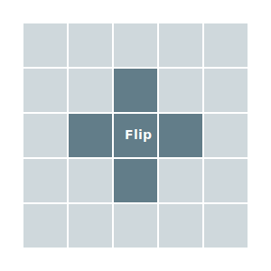
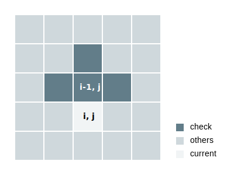

# POJ 3279 Fliptile


遥远的那边有\\(M \times N\\) \\((1 \le M, N \le 15)\\)块瓷砖。每块瓷砖都能被翻转，它的两面分别是白色（0）和黑色（1）。

当你翻转一块砖的时候，相邻的四块砖也会被翻转。注意它们的翻转不会带动它们相邻的再继续翻转喔。

现在给你一种布局，输出翻转哪些瓷砖，使得所有瓷砖都变成白色，且翻转数目最小。如果有多种翻转方法但翻转数相同，输出字典序<sup>1</sup>最小的。

如果没有解，输出"IMPOSSIBLE"。

链接: http://poj.org/problem?id=3279



<sub>*1 字典序：从左往右读，比较每个字符在字典中出现的先后顺序， 比如说：\\((AA \lt AB \lt BA \lt BB \\))。在今天瓷砖的这个情境下，我们从左往右然后从上往下读* </sub>

```
0 0 0       0 0 0       1 0 0
0 0 0   <   1 1 1   <   0 0 0
0 0 0       1 1 1       0 0 0
```

<br />
<br />
<br />
<br />
<br />

:warning:再努力想想

<br />
<br />
<br />
<br />
<br />

### 题解

暴力的时间复杂度有\\(O(2^{MN})\\)，是肯定超时的。为什么是\\(O(2^{MN})\\)？每块瓷砖有两种状态——翻或不翻，一共有\\(M \times N\\)块瓷砖。

我们能看到一块瓷砖的颜色只取决于相邻四块瓷砖和自己的翻转状态。

> 5 翻转状态 => 颜色

如果我们知道了**四**个翻转状态和**一**个颜色，我们能找出最后一个翻转状态吗？显然是可以的。颜色我们肯定希望是白色。但是问题是哪四个呢？肯定不是周围四个，那样和暴力没差。

不如试试用靠上的四个？这样我们就能知道底下的瓷砖该不该翻转了。如果我们在一行上进行这个操作，整行的翻转状态都能知道了。

> 4 翻转状态 + 颜色 => 1 翻转状态

还可以换个方式想，如果我们知道一个瓷砖上，左，右和它自己的翻转状态，我们就能暂时知道它的颜色。如果是黑色，我们就翻转下面的瓷砖，让它变成白色。

> 4 翻转状态 => 颜色 => 需要翻转?



最后两个问题，我们怎么开始呢？如何知道全部翻转完成后是否成功呢？

- 我们可以直接尝试第一行所有的可能性。
- 在最后我们可以查看最后一行的颜色。如果还有黑色，则失败。

我们还需要维护最小翻转数和那时所有的翻转状态。因为我们从最小字典序开始循环，所以第一个有着最少翻动数的解就是最小字典序的解啦！可以完全不用担心这一块。


时间复杂度：\\(O(MN2^N)\\)

### AC 代码
```cpp
#include <iostream>
#include <cstring>
using namespace std;

const int INF = 0x3f3f3f3f;
const int maxn = 20;

// 只用查询上，左，右和自己
// 不过反正下面也一直是0
const int dx[] = {0,-1,0,0};
const int dy[] = {0,0,1,-1};

int m, n;
int p[maxn][maxn]; // 输入的布局
int ans[maxn][maxn]; // 最后的答案
int cur[maxn][maxn]; // 当前的翻转状态
int mini;
int tmp; // 当前的翻转数

/* 查找颜色 */
int chk(int r, int c) {
    int sum = p[r][c];
    for (int i = 0; i < 4; i++) {
        int x = r+dx[i];
        int y = c+dy[i];
        if (x >= 0 && x < m && y >=0 && y < n) {
            sum += cur[x][y];
        }
    }

    // 和sum % 2是一样的
    return sum & 0x1;
}

void solve() {
    // 从第二行开始循环
    for (int i = 1; i < m; i++) {
        for (int j = 0; j < n; j++) {
            if (chk(i-1, j)) {
                cur[i][j] = 1;
                tmp++;
            }
        }
    }

    // 检查最后一行颜色
    for (int i = 0; i < n; i++) {
        if (chk(m-1, i)) {
            return ;
        }
    }

    // 是不是最小
    if (tmp < mini) {
        mini = tmp;
        memcpy(ans, cur, sizeof(ans));
    }
}

int main(void) {
    while (cin >> m >> n) {
        mini = INF;

        for (int i = 0; i < m; i++) {
            for (int j = 0; j < n; j++) {
                cin >> p[i][j];
            }
        }

        // 遍历第一行的所有可能
        for (int i = 0; i < (1 << n); i++) {
            tmp = 0;
            memset(cur, 0, sizeof(cur));

            // 给第一行赋值
            for(int j = 0; j < n; j++) {
                int t = i >> j & 0x1;
                cur[0][n-1-j] = t;
                if (t) tmp++;
            }

            solve();
        }

        if (mini == INF) {
            cout << "IMPOSSIBLE" << endl;
        } else {
            for (int j = 0; j < m; j++) {
                for (int k = 0; k < n; k++) {
                    cout << ans[j][k] << (k == n-1 ? "\n" : " ");
                }
            }
        }
    }

    return 0;
}
```
